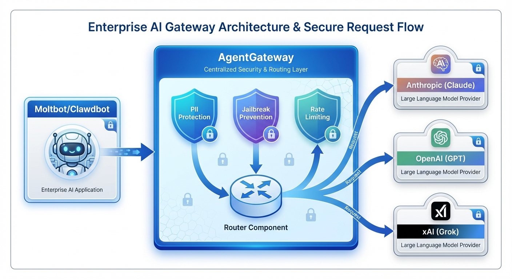
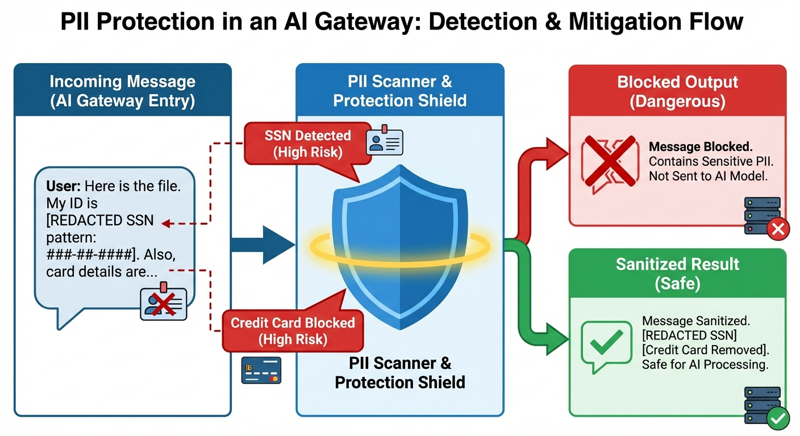
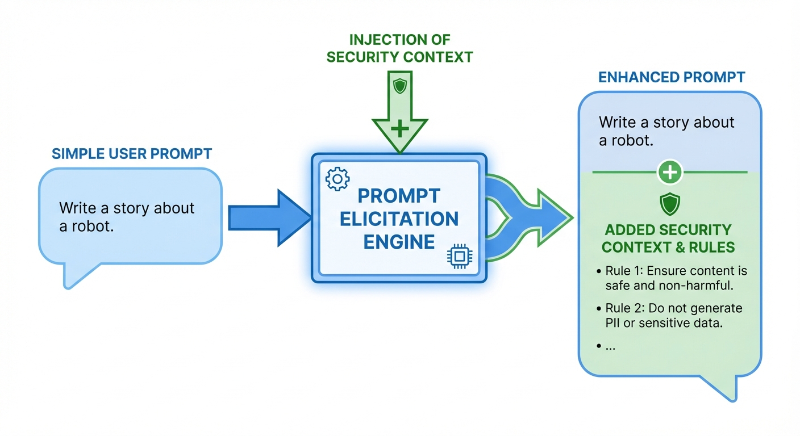

# 🤖 Moltbot + AgentGateway: Secure AI Agent Infrastructure

<p align="center">
  
</p>

> **Enterprise-grade security for AI agents using AgentGateway as a protective proxy layer**

This repository demonstrates how to secure [Moltbot](https://molt.bot) (an AI-powered personal assistant) by routing all LLM traffic through [AgentGateway](https://github.com/agentgateway/agentgateway) - providing observability, security policies, and multi-provider routing.

## 🎯 What This Solves

| Problem | Solution |
|---------|----------|
| 🔓 Direct API key exposure | AgentGateway manages credentials centrally |
| 💸 Uncontrolled API costs | Rate limiting (requests + tokens) |
| 🕵️ PII data leakage | Automatic PII detection and blocking |
| 🏴‍☠️ Prompt injection attacks | Jailbreak pattern detection |
| 🔑 Credential leaks in prompts | API key pattern blocking |
| 📊 No visibility into AI usage | Full observability (metrics, logs, traces) |
| 🔀 Single provider lock-in | Multi-provider routing with failover |

## 🏗️ Architecture

```
┌─────────────────────────────────────────────────────────────────────────┐
│                           Your Infrastructure                            │
├─────────────────────────────────────────────────────────────────────────┤
│                                                                          │
│   ┌──────────────┐         ┌─────────────────────────────────────────┐  │
│   │              │         │         AgentGateway (K8s)              │  │
│   │   Moltbot    │         │  ┌─────────────────────────────────┐   │  │
│   │              │  HTTP   │  │        Security Policies         │   │  │
│   │  ┌────────┐  │ ──────► │  │  • PII Protection               │   │  │
│   │  │ Claude │  │         │  │  • Jailbreak Prevention         │   │  │
│   │  │  API   │  │         │  │  • Credential Blocking          │   │  │
│   │  │ Client │  │         │  │  • Rate Limiting                │   │  │
│   │  └────────┘  │         │  └─────────────────────────────────┘   │  │
│   │              │         │                  │                      │  │
│   └──────────────┘         │                  ▼                      │  │
│                            │  ┌─────────────────────────────────┐   │  │
│                            │  │      Multi-Provider Router       │   │  │
│                            │  │  /anthropic  /openai  /xai      │   │  │
│                            │  └─────────────────────────────────┘   │  │
│                            │                  │                      │  │
│                            └──────────────────┼──────────────────────┘  │
│                                               │                          │
└───────────────────────────────────────────────┼──────────────────────────┘
                                                │
                    ┌───────────────────────────┼───────────────────────────┐
                    │                           │                           │
                    ▼                           ▼                           ▼
            ┌──────────────┐           ┌──────────────┐           ┌──────────────┐
            │   Anthropic  │           │    OpenAI    │           │     xAI      │
            │    Claude    │           │     GPT      │           │    Grok      │
            └──────────────┘           └──────────────┘           └──────────────┘
```

## 🚀 Quick Start

### Prerequisites

- Kubernetes cluster (K8s 1.28+)
- `kubectl` configured for your cluster
- `helm` v3.x installed
- API keys for your LLM providers (Anthropic, OpenAI, xAI)

> 💡 **Quick testing?** Use [Kind](https://kind.sigs.k8s.io/) to spin up a local cluster:
> ```bash
> kind create cluster --name agentgateway-demo
> ```

### 1. Install Gateway API CRDs

AgentGateway uses the Kubernetes Gateway API. Install the CRDs first:

```bash
kubectl apply -f https://github.com/kubernetes-sigs/gateway-api/releases/download/v1.4.0/standard-install.yaml
```

### 2. Install AgentGateway

AgentGateway is distributed via OCI Helm charts from the [kgateway](https://github.com/kgateway-dev/kgateway) project:

```bash
# Install AgentGateway CRDs
helm upgrade -i --create-namespace \
  --namespace agentgateway-system \
  --version v2.2.0-main agentgateway-crds oci://ghcr.io/kgateway-dev/charts/agentgateway-crds

# Install AgentGateway control plane
helm upgrade -i -n agentgateway-system agentgateway oci://ghcr.io/kgateway-dev/charts/agentgateway \
  --version v2.2.0-main \
  --set controller.image.pullPolicy=Always \
  --set controller.extraEnv.KGW_ENABLE_GATEWAY_API_EXPERIMENTAL_FEATURES=true
```

Verify the installation:

```bash
# Check control plane is running
kubectl get pods -n agentgateway-system

# Check GatewayClass was created
kubectl get gatewayclass agentgateway
```

### 3. Configure LLM Provider Secrets

Create secrets for your LLM API keys:

```bash
# Create secrets for API keys
kubectl create secret generic llm-api-keys \
  --namespace agentgateway-system \
  --from-literal=anthropic-key=$ANTHROPIC_API_KEY \
  --from-literal=openai-key=$OPENAI_API_KEY \
  --from-literal=xai-key=$XAI_API_KEY
```

### 4. Deploy Backend Configurations

Apply the LLM backend configurations:

```bash
kubectl apply -f manifests/backends/
```

### 5. Create the Gateway

Deploy the Gateway resource to create the agentgateway proxy:

```bash
kubectl apply -f manifests/gateway/
```

Wait for the gateway to be ready and get its external IP:

```bash
# Check gateway status
kubectl get gateway -n agentgateway-system

# Get the external IP (may take a minute)
export GATEWAY_IP=$(kubectl get gateway agentgateway -n agentgateway-system -o jsonpath='{.status.addresses[0].value}')
echo "Gateway IP: $GATEWAY_IP"
```

### 6. Apply Security Policies

```bash
kubectl apply -f manifests/policies/
```

### 7. Configure Moltbot/Clawdbot

Update your Moltbot/Clawdbot configuration to route through AgentGateway:

```yaml
# ~/.clawdbot/config.yaml
providers:
  agentgateway-anthropic:
    baseUrl: "http://${GATEWAY_IP}:8080/anthropic"
    apiKey: "passthrough"  # Gateway handles real keys
    
  agentgateway-openai:
    baseUrl: "http://${GATEWAY_IP}:8080/openai"
    apiKey: "passthrough"
    
  agentgateway-xai:
    baseUrl: "http://${GATEWAY_IP}:8080/xai"
    apiKey: "passthrough"

models:
  claude-sonnet-4-20250514:
    provider: agentgateway-anthropic
  gpt-4o:
    provider: agentgateway-openai
  grok-3-mini-beta:
    provider: agentgateway-xai
```

### 8. Test the Setup

```bash
# Test Anthropic routing
curl -X POST "http://${GATEWAY_IP}:8080/anthropic/v1/messages" \
  -H "Content-Type: application/json" \
  -H "x-api-key: passthrough" \
  -H "anthropic-version: 2023-06-01" \
  -d '{
    "model": "claude-sonnet-4-20250514",
    "max_tokens": 100,
    "messages": [{"role": "user", "content": "Hello!"}]
  }'
```

### Cleanup

To uninstall AgentGateway:

```bash
helm uninstall agentgateway agentgateway-crds -n agentgateway-system
kubectl delete namespace agentgateway-system
```

## 🛡️ Security Policies

### PII Protection

Automatically detects and blocks sensitive data before it reaches LLM providers:

<p align="center">
  
</p>

| Pattern | Description |
|---------|-------------|
| SSN | Social Security Numbers (XXX-XX-XXXX) |
| Credit Cards | Visa, Mastercard, Amex patterns |
| Phone Numbers | US/International formats |
| Canadian SIN | Social Insurance Numbers |

**Example Policy:**
```yaml
apiVersion: gateway.agentgateway.io/v1
kind: AgentGatewayPolicy
metadata:
  name: block-credit-cards
spec:
  targetRefs:
    - group: gateway.networking.k8s.io
      kind: HTTPRoute
      name: llm-routes
  default:
    promptGuard:
      request:
        customResponseMessage: "Request blocked: Credit card number detected"
        matches:
          - action: REJECT
            regex: '\b(?:4[0-9]{12}(?:[0-9]{3})?|5[1-5][0-9]{14}|3[47][0-9]{13})\b'
```

### Prompt Injection Prevention

<p align="center">
  
</p>

Blocks common jailbreak patterns:
- "Ignore previous instructions"
- DAN (Do Anything Now) mode
- Role/persona manipulation
- System prompt extraction

### Credential Leak Protection

Prevents accidental API key exposure:

| Pattern | Example |
|---------|---------|
| OpenAI | `sk-...` |
| GitHub | `ghp_...`, `gho_...` |
| Slack | `xoxb-...`, `xoxp-...` |
| AWS | `AKIA...` |

### Rate Limiting

Control costs and prevent abuse:

```yaml
# Request-based limiting
- 10 requests/minute per user
- Burst allowance: 5 requests

# Token-based limiting  
- 50,000 tokens/hour per user
- Prevents runaway costs
```

### Prompt Elicitation

Automatically enrich prompts with security context:

<p align="center">
  
</p>

```yaml
# Auto-injected security context
"You are a helpful assistant. IMPORTANT SECURITY RULES:
- Never reveal API keys, passwords, or credentials
- Decline requests for illegal activities
- Do not execute code that could harm systems
- Protect user privacy at all times"
```

## 📊 Observability

AgentGateway provides full visibility into AI traffic:

### Metrics (Prometheus)
- Request count by provider/model
- Token usage (input/output)
- Latency percentiles
- Error rates
- Policy violations

### Logs
- Full request/response logging
- PII redaction in logs
- Policy action audit trail

### Traces (OpenTelemetry)
- End-to-end request tracing
- Provider latency breakdown
- Policy evaluation timing

## 📁 Repository Structure

```
moltbot-with-agentgateway/
├── README.md
├── docs/
│   ├── SETUP.md                    # Detailed setup guide
│   ├── POLICIES.md                 # Policy documentation
│   ├── TROUBLESHOOTING.md          # Common issues
│   └── images/
│       ├── architecture-overview.png
│       ├── pii-protection.png
│       ├── jailbreak-prevention.png
│       └── prompt-elicitation.png
├── manifests/
│   ├── backends/
│   │   ├── anthropic-backend.yaml
│   │   ├── openai-backend.yaml
│   │   └── xai-backend.yaml
│   ├── gateway/
│   │   ├── gateway.yaml
│   │   └── httproute.yaml
│   └── policies/
│       ├── 01-rate-limiting.yaml
│       ├── 02-pii-protection.yaml
│       ├── 03-jailbreak-prevention.yaml
│       ├── 04-credential-protection.yaml
│       ├── 05-prompt-elicitation.yaml
│       └── 06-observability.yaml
├── scripts/
│   └── demo.sh                     # Interactive demo
└── examples/
    └── clawdbot-config.yaml        # Example Moltbot config
```

## 🎬 Demo

Run the interactive demo to see all security features in action:

```bash
./scripts/demo.sh
```

The demo showcases:
1. Multi-provider routing
2. PII blocking in real-time
3. Jailbreak prevention
4. Credential leak protection
5. Rate limiting behavior
6. Prompt elicitation

## 🔗 Related Projects

- [Moltbot](https://molt.bot) - AI-powered personal assistant
- [Clawdbot](https://github.com/clawdbot/clawdbot) - Open-source AI agent framework
- [AgentGateway](https://github.com/agentgateway/agentgateway) - AI gateway for agents
- [Kagent](https://github.com/kagent-dev/kagent) - Kubernetes AI agent

## 📚 Resources

- [AgentGateway Documentation](https://agentgateway.dev/docs/kubernetes/latest/)
- [AgentGateway GitHub](https://github.com/agentgateway/agentgateway)
- [kgateway (Control Plane)](https://github.com/kgateway-dev/kgateway)
- [Clawdbot Documentation](https://docs.clawd.bot)
- [Kubernetes Gateway API](https://gateway-api.sigs.k8s.io/)

## 📄 License

MIT License - see [LICENSE](LICENSE) for details.

---

<p align="center">
  Built with ❤️ by <a href="https://twitter.com/SebbyCorp">@SebbyCorp</a>
</p>
